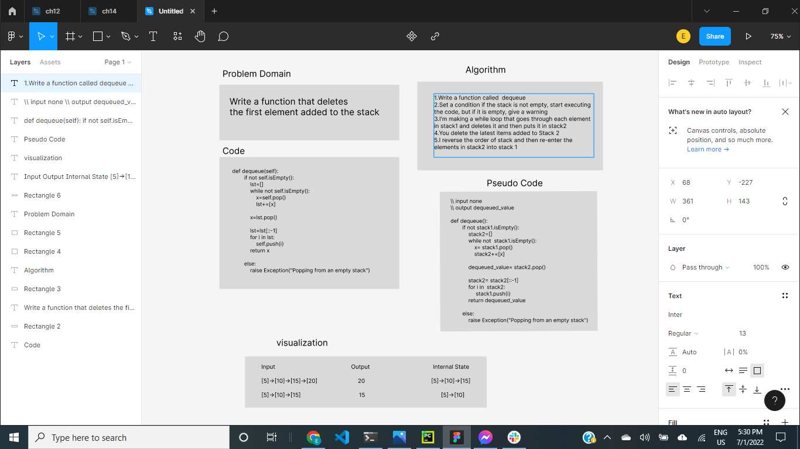

# stack-queue-pseudo
- Create a new class called pseudo queue.
- Do not use an existing Queue.
- Instead, this PseudoQueue class will implement our standard queue interface (the two methods listed below),
- Internally, utilize 2 Stack instances to create and manage the queue
- methods are enqueue and dequeue
## Whiteboard Process

.png)




### Approach & Efficiency
- The time complexity of the enqueue is o(1) because it is a normal push
- The time complexity ofteh dequeue is o(n) because i used while loop to move all the elements form stack1 to stack2
#### Solution
```
class Pseudo_queue:


    def __init__(self):
        self.head = Node("head")
        self.size = 0


    def __str__(self):
        cur = self.head.next
        out = ""
        while cur:
            out += str(cur.value) + "->"
            cur = cur.next
        return out


    def getSize(self):
        return self.size


    def isEmpty(self):
        return self.size == 0

    def peek(self):


        if self.isEmpty():
            raise Exception("Peeking from an empty stack")
        return self.head.next.value


    def push(self, value):
        node = Node(value)
        node.next = self.head.next
        self.head.next = node
        self.size += 1


    def pop(self):
        if self.isEmpty():
            raise Exception("Popping from an empty stack")
        remove = self.head.next
        self.head.next = self.head.next.next
        self.size -= 1
        return remove.value


    def enqueue(self,value):
        self.push(value)


    def dequeue(self):
        if not self.isEmpty():
            lst=[]
            while not self.isEmpty():
                x=self.pop()
                lst+=[x]

            x=lst.pop()
            print(x)
            lst=lst[::-1]
            for i in lst:
                self.push(i)
            return x

        else:
            raise Exception("Popping from an empty stack")
```


