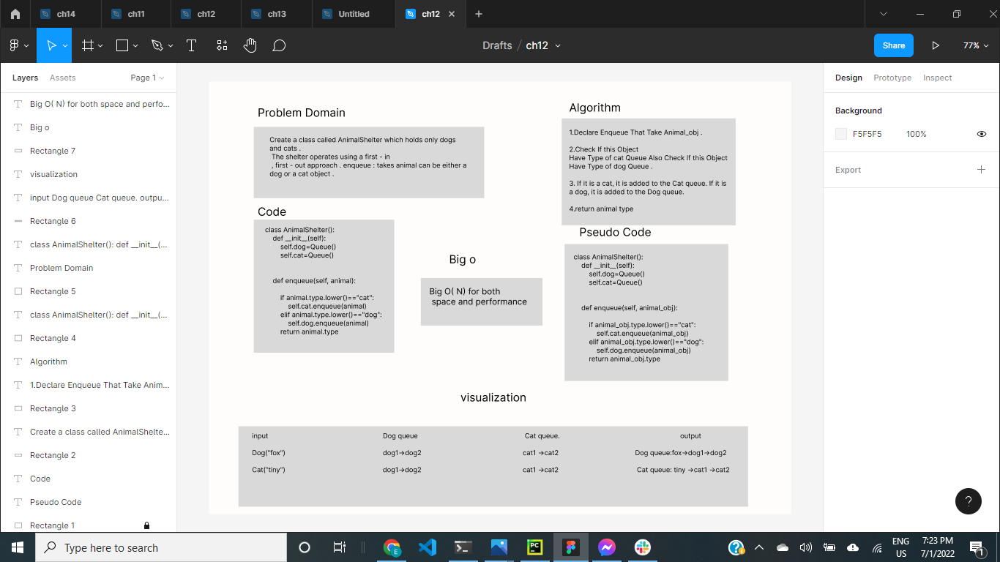
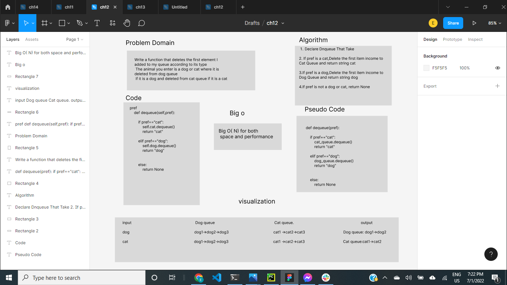

# Challenge Summary
Create a class called AnimalShelter which holds only dogs and cats.
The shelter operates using a first-in, first-out approach.
Implement the following methods:
### enqueue
* Arguments: animal
* animal can be either a dog or a cat object.
### dequeue
* Arguments: pref
* pref can be either "dog" or "cat"
* Return: either a dog or a cat, based on preference.
If pref is not "dog" or "cat" then return n

## Whiteboard Process




## Approach & Efficiency

I followed the approach that the code takes the least time and space, where B(o) takes space and time and be simple to be easy to understand


## Solution
```
#Create a class named Dog that takes the name and type of the dog
class Dog:
    def __init__(self,name,type="dog"):
        self.name=name
        self.type=type
#Create a class named Cat that takes the name and type of the cat
class Cat:
    def __init__(self,name,type="cat"):
        self.name=name
        self.type=type

#Create a class named AnimalShelter
class AnimalShelter():
    def __init__(self):
        self.dog=Queue()
        self.cat=Queue()

    #Declare Enqueue That Take Animal_obj
    def enqueue(self, animal):
        # If animal type is a cat, it is added to the Cat queue.
        if animal.type.lower()=="cat":
            self.cat.enqueue(animal)
        # If animal type is a dog, it is added to the Dog queue.
        elif animal.type.lower()=="dog":
            self.dog.enqueue(animal)
        # return animal type
        return animal.type


    #Declare Dnqueue That Take pref
    def dequeue(self,pref):
        # If pref is a cat,Delete the first item income to Cat Queue and return string cat
        if pref=="cat":
            self.cat.dequeue()
            return "cat"
        # If pref is a dog,Delete the first item income to Dog Queue and return string dog
        elif pref=="dog":
            self.dog.dequeue()
            return "dog"

        #If pref is not a dog or cat, return None
        else:
            return None
```