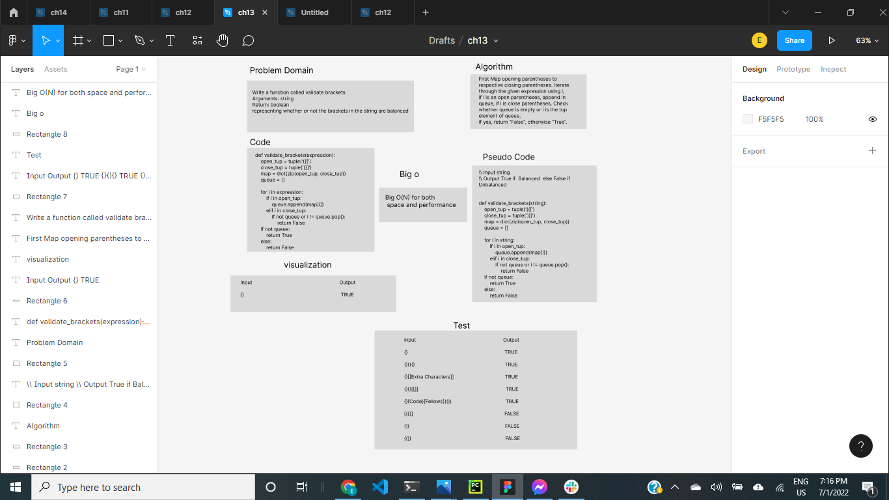

# Challenge Summary

Write a function called validate brackets

Arguments: string

Return: boolean

representing whether or not the brackets in the string are balanced


## Whiteboard Process




## Approach & Efficiency

I followed the approach that the code takes the least time and space, where B(o) takes space and time and be simple to be easy to understand

## Solution
```
def validate_brackets(expression):
    open_tup = tuple('({[')
    close_tup = tuple(')}]')
    map = dict(zip(open_tup, close_tup))
    queue = []

    for i in expression:
        if i in open_tup:
            queue.append(map[i])
        elif i in close_tup:
            if not queue or i != queue.pop():
                return False
    if not queue:
        return True
    else:
        return False
```