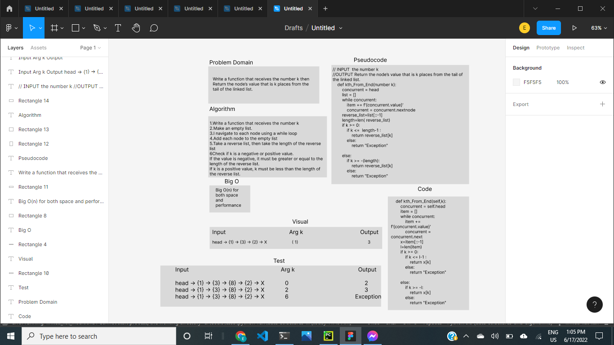

# Challenge Summary
Write the following method for the Linked List class:

kth from end

argument: a number, k, as a parameter.

Return the node’s value that is k places from the tail of the linked list.

You have access to the Node class and all the properties on the Linked List class as well as the methods created in previous challenges.

## Whiteboard Process

## Approach & Efficiency

I followed the approach that the code takes the least time and space, where B(o) takes space and time and be simple to be easy to understand

## Solution
    def kth_From_End(self,k):
        concurrent = self.head
        item = []
        while concurrent:
            item += f'{concurrent.value}'
            concurrent = concurrent.next
        x=item[::-1]
        l=len(item)
        if k >= 0:
            if k <= l-1 :
                return x[k]
            else:
                return "Exception"

        else:
            return "Exception"