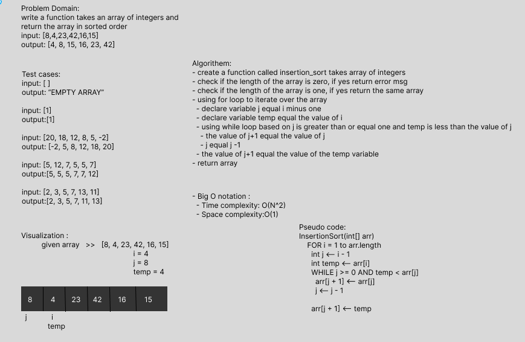

# Challenge Summary
- write a function takes an array of integers and return sorted array
- Review the pseudocode below, then trace the algorithm by stepping through the process with the provided sample array.
- Document your explanation by creating a blog article that shows the step-by-step output after each iteration through some sort of visual.
- Once you are done with your article, code a working, tested implementation of Insertion Sort based on the pseudocode provided.

# Whiteboard Process

 

# Approach
- insertion sort algorithm 

# Efficiency
- Big O notation : 
  - Time complexity: O(N^2)
  - Space complexity:O(1)

#  Solution
- create a function called insertion_sort takes array of integers
- check if the length of the array is zero, if yes return error msg 
- check if the length of the array is one, if yes return the same array
- using for loop to iterate over the array 
  - declare variable j equal i minus one 
  - declare variable temp equal the value of i 
  - using while loop based on j is greater than or equal one and temp is less than the value of j 
    - the value of j+1 equal the value of j 
    - j equal j -1 
  - the value of j+1 equal the value of the temp variable 
- return array

## TEST
- all tests passed
  - pytest .\tests\test_insertion_sort.py   

